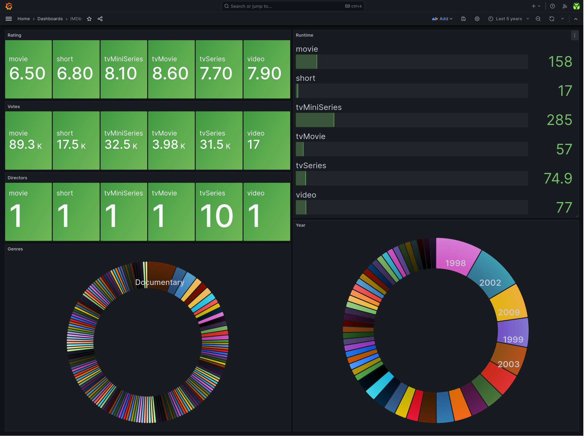

# ARCHIVED

IMDB changed their public API, this script is no longer able to automatically download the watchlist data. The converter logic from csv file to influxdb might still work.

# imdb-exporter

Bash script that uploads the IMDb Watchlist data to influxdb on a daily basis

## Dependencies

- [bash](https://www.gnu.org/software/bash/)
- [curl](https://curl.se/)
- [gawk](https://www.gnu.org/software/gawk/)
- [gzip](https://www.gnu.org/software/gzip/)
- [influxdb v2+](https://docs.influxdata.com/influxdb/v2.6/)
- [systemd](https://systemd.io/)
- Optional:
  - [make](https://www.gnu.org/software/make/) - for automatic installation support
  - [docker](https://docs.docker.com/)

## Relevant documentation

- [InfluxDB API](https://docs.influxdata.com/influxdb/v2.6/write-data/developer-tools/api/)
- [Systemd Timers](https://www.freedesktop.org/software/systemd/man/systemd.timer.html)
- [reddec/compose-scheduler](https://github.com/reddec/compose-scheduler)

## Installation

### With Docker

#### docker-compose

1. Configure `imdb_exporter.conf` (see the configuration section below).
1. Run it.

   ```bash
   docker compose up --detach
   ```

#### docker build & run

1. Build the docker image.

   ```bash
   docker build . --tag imdb-exporter
   ```

1. Configure `imdb_exporter.conf` (see the configuration section below).
1. Run it.

   ```bash
    docker run --rm --init --tty --interactive --read-only --cap-drop ALL --security-opt no-new-privileges:true --cpus 2 -m 64m --pids-limit 16 --volume ./imdb_exporter.conf:/app/imdb_exporter.conf:ro ghcr.io/rare-magma/imdb-exporter:latest
    ```

### With the Makefile

For convenience, you can install this exporter with the following command or follow the manual process described in the next paragraph.

```bash
make install
$EDITOR $HOME/.config/imdb_exporter.conf
```

### Manually

1. Copy `imdb_exporter.sh` to `$HOME/.local/bin/` and make it executable.

2. Copy `imdb_exporter.conf` to `$HOME/.config/`, configure it (see the configuration section below) and make it read only.

3. Copy the systemd unit and timer to `$HOME/.config/systemd/user/`:

   ```bash
   cp imdb-exporter.* $HOME/.config/systemd/user/
   ```

4. and run the following command to activate the timer:

   ```bash
   systemctl --user enable --now imdb-exporter.timer
   ```

It's possible to trigger the execution by running manually:

```bash
systemctl --user start imdb-exporter.service
```

### Config file

The config file has a few options:

```bash
INFLUXDB_HOST='influxdb.example.com'
INFLUXDB_API_TOKEN='ZXhhbXBsZXRva2VuZXhhcXdzZGFzZGptcW9kcXdvZGptcXdvZHF3b2RqbXF3ZHFhc2RhCg=='
ORG='home'
BUCKET='imdb'
IMDB_WATCHLIST_ID='ls000111111'
```

- `INFLUXDB_HOST` should be the FQDN of the influxdb server.
- `ORG` should be the name of the influxdb organization that contains the IMDb data bucket defined below.
- `BUCKET` should be the name of the influxdb bucket that will hold the IMDb data.
- `INFLUXDB_API_TOKEN` should be the influxdb API token value.
  - This token should have write access to the `BUCKET` defined above.
- `IMDB_WATCHLIST_ID` should be the imdb watchlist ID value.
  - This ID can be retrieved from the "Export this list" link displayed at the bottom of the [watchlist page](https://www.imdb.com/list/watchlist) on IMDb.

## Troubleshooting

Run the script manually with bash set to trace:

```bash
bash -x $HOME/.local/bin/imdb_exporter.sh
```

Check the systemd service logs and timer info with:

```bash
journalctl --user --unit imdb-exporter.service
systemctl --user list-timers
```

## Exported metrics

- imdb_stats: Watchlist item metadata

## Exported metrics example

```bash
imdb_stats,title_type=movie,genres=Action\ Adventure\ Biography\ Drama\ History\ War,year=2023 position=697,imdb_id="tt13287846",title="Napoleon",imdb_rating=6.5,runtime_mins=158,imdb_votes=89277,release_date="2023-11-14",directors="Ridley Scott" 1705190400
```

## Example grafana dashboard

In `imdb-dashboard.json` there is an example of the kind of dashboard that can be built with `imdb-exporter` data:



Import it by doing the following:

1. Create a dashboard
2. Click the dashboard's settings button on the top right.
3. Go to JSON Model and then paste there the content of the `imdb-dashboard.json` file.

## Uninstallation

### With the Makefile

For convenience, you can uninstall this exporter with the following command or follow the process described in the next paragraph.

```bash
make uninstall
```

### Manually

Run the following command to deactivate the timer:

```bash
systemctl --user disable --now imdb-exporter.timer
```

Delete the following files:

```bash
~/.local/bin/imdb_exporter.sh
~/.config/imdb_exporter.conf
~/.config/systemd/user/imdb-exporter.timer
~/.config/systemd/user/imdb-exporter.service
```

## Credits

- [reddec/compose-scheduler](https://github.com/reddec/compose-scheduler)
